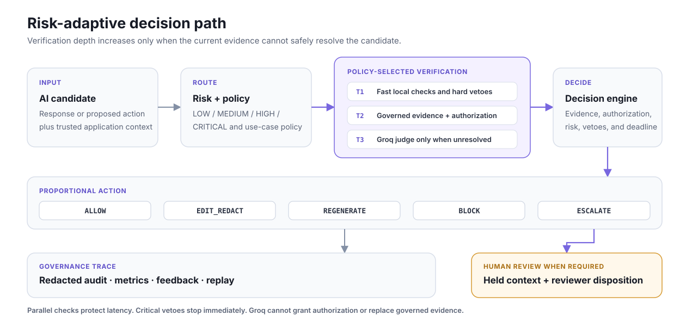

# ControlPlane.ai

**Risk-adaptive verification middleware for enterprise AI responses and agent actions.**

ControlPlane sits between an AI application and the user or tool affected by its
output. Before release, it evaluates the candidate against risk, policy, governed
evidence, authorization, reversibility, and prior outcomes. It returns one auditable
action: `ALLOW`, `EDIT_REDACT`, `REGENERATE`, `BLOCK`, or `ESCALATE`.

This repository is Team Noir's working proof of concept for the Accenture Innovation
Challenge 2026, Problem Track 1.

## The problem we solve

Enterprise AI use cases do not share one risk profile. Applying every available check
to every output increases latency, cost, and alert fatigue. Applying only lightweight
checks allows high-consequence failures to escape.

ControlPlane demonstrates a different tradeoff:

- classify the consequence and context of each candidate;
- select checks from a versioned policy for that use case and risk tier;
- run independent checks in parallel and stop when the decision is known;
- call the Groq AI judge only when policy and unresolved evidence require it;
- fail safely on critical vetoes, exhausted latency, or unavailable verification;
- preserve the redacted decision trace for review, metrics, feedback, and replay.

The result is defense in depth without paying the deepest verification cost on every
request.

## How it works

<p align="center">
  
</p>

### Adaptive verification path

1. **Risk profiling** combines the use case, candidate type, trusted workflow context,
   reversibility, authorization signals, and adverse-outcome history.
2. **Policy routing** selects only the detectors required for the resulting
   `LOW`, `MEDIUM`, `HIGH`, or `CRITICAL` tier.
3. **Tiered execution** runs checks in parallel within each tier. A critical policy
   veto or sufficient resolution stops deeper work early.
4. **Governed evidence** accepts only configured sources with approved status,
   authority, version, and checksum metadata.
5. **AI-as-judge fallback** sends Groq only a redacted candidate and accumulated
   retrieval trace. The judge must classify that supplied evidence and cannot use its
   own knowledge as ground truth or override authorization.
6. **Decision and handoff** return machine-readable reasons, retry guidance, measured
   latency, checker results, and a human-review requirement when applicable.

## Decision contract

| Action | Host application behavior |
|---|---|
| `ALLOW` | Required checks passed; release the candidate. |
| `EDIT_REDACT` | Release only the sanitized output returned by ControlPlane. |
| `REGENERATE` | Retry with the recorded failure reason and a bounded attempt count. |
| `BLOCK` | Do not release or execute the candidate. |
| `ESCALATE` | Hold the candidate and send its redacted review packet to a human. |

ControlPlane evaluates one candidate at a time; it does not call the source AI again.
The returned action guidance caps regeneration attempts and specifies what to do when
the retry is exhausted, preventing an internal regeneration loop.

## What the prototype demonstrates

| Stage 2 concern | Implemented mechanism |
|---|---|
| Different risk and latency needs | Four risk tiers, per-use-case YAML policies, parallel groups, early stopping, and fail modes |
| Overlapping risks | PII, claims, evidence, entitlement, engineering safety, secrets, permissions, reversibility, and history contribute to one decision |
| Missing ground truth | Governed retrieval distinguishes verified, contradicted, uncertain, no-evidence, and not-applicable states |
| Proportional intervention | Five actions separate safe release, correction, hard prevention, and human review |
| Configurable governance | Versioned policies and source metadata control checks, vetoes, authority, and acceptable source states |
| Auditability | Redacted SQLite records retain policy/source versions, checksums, route, stop reason, latency, and result |
| Human oversight | A dedicated queue shows held context and records reviewer dispositions without silently releasing the candidate |
| Feedback and monitoring | Reviewer labels, adverse-outcome history, decision metrics, latency, check count, cost units, and model-call totals |

The simulated scope covers engineering development/production and customer-support
informational/transactional workflows. It requires no proprietary enterprise data.

## Demo console

The Streamlit console is designed for a short judge walkthrough:

| Page | What to show |
|---|---|
| **Run scenario** | Original request, AI candidate, risk, selected route, observed latency, checker outcomes, decision reason, and raw JSON |
| **Human review** | Held escalations, redacted reviewer context, evidence/authorization state, and recorded disposition |
| **Audit trail** | Stored decisions with policy, evidence, checks, stop reason, and redacted input |
| **Policies** | Per-use-case risk configuration, required checks, governed sources, and non-negotiable vetoes |
| **Metrics** | Decisions, stopping reasons, latency, checks, cost units, model calls, and feedback summaries |
| **Feedback** | Human labels captured for offline calibration and future risk signals |

Useful scenarios for a demo:

| Scenario | Point demonstrated | Expected action |
|---|---|---|
| Safe development edit | Low-risk deterministic route stops early | `ALLOW` |
| Unbounded production delete | Critical safety veto is never averaged away | `BLOCK` |
| PII in a support answer | Sensitive content is removed without discarding the safe answer | `EDIT_REDACT` |
| Informational answer without evidence | Low-risk unsupported content is corrected locally | `REGENERATE` |
| Judge-assisted refund answer | Medium-risk uncertainty reaches Groq but not unnecessary human review | `REGENERATE` |
| High-risk unsupported commitment | Unresolved high-consequence content is held for review | `ESCALATE` |
| Unauthorized cancellation | Evidence cannot substitute for identity or permission | `BLOCK` |

## Run locally

Requirements: Python 3.11 and Git.

### Windows PowerShell

```powershell
git clone https://github.com/hrushikeshroop/Accenture_Hackathon.git
cd Accenture_Hackathon
py -3.11 -m venv .venv
.venv\Scripts\Activate.ps1
python -m pip install -r requirements.txt
Copy-Item .env.example .env
python scripts\run_demo.py --fresh-db
```

### macOS or Linux

```bash
git clone https://github.com/hrushikeshroop/Accenture_Hackathon.git
cd Accenture_Hackathon
python3.11 -m venv .venv
source .venv/bin/activate
python -m pip install -r requirements.txt
cp .env.example .env
python scripts/run_demo.py --fresh-db
```

Open the Streamlit URL printed in the terminal. API documentation is available at
`http://127.0.0.1:8000/docs`. The launcher starts and stops both services together;
`--fresh-db` creates an isolated audit database for a reproducible walkthrough.

## Enable the live Groq judge

The PoC fixes the provider endpoint and free-tier model in code. Add only your own key
to the ignored `.env` file:

```dotenv
GROQ_API_KEY=your_key_here
```

Then start the normal demo or run the three judge-focused cases directly:

```powershell
python scripts\run_live_judge_demo.py
```

The live path uses Groq's OpenAI-compatible chat-completions endpoint with
`qwen/qwen3.8-27b`, a short timeout, JSON output, and a bounded completion size. If the
provider is missing, unavailable, or returns an invalid response, the detector records
the failure and the policy fails safely. Never commit `.env` or expose the key in a
demo recording.

## Verified results

Run the complete local verification:

```powershell
$env:CONTROLPLANE_RUN_LIVE_JUDGE="1"
pytest -q
Remove-Item Env:CONTROLPLANE_RUN_LIVE_JUDGE
python scripts\run_all_scenarios.py
python evaluation\run_evaluation.py
python scripts\run_policy_replay_demo.py
python scripts\run_model_judge_demo.py
```

Current repository results:

- **117 automated tests passed** in the configured full run, including 3 live Groq
  integration cases.
- **17/17 labelled scenarios** matched their expected actions.
- **0.0 false-block rate** on the included labelled fixtures.
- **0.0 unsafe-escape rate** on the included labelled fixtures.
- **4.53 average checks** executed per deterministic scenario.
- **0 external model calls** during the deterministic evaluation suite.

The live integration cases reached Groq and produced the intended proportional
outcomes:

| Live case | Risk | Observed action |
|---|---|---|
| Mixed-evidence refund answer | `MEDIUM` | `REGENERATE` |
| Unsupported high-risk guarantee | `HIGH` | `ESCALATE` |
| Unsupported plan-change promise | `CRITICAL` | `ESCALATE` |

These measurements describe only the included simulated fixtures. They are not claims
of production accuracy, safety, throughput, or provider availability.

## Repository map

```text
controlplane/  FastAPI middleware, routing, detectors, decisions, and audit storage
dashboard/     Streamlit decision console
policies/      Versioned risk and verification policies
knowledge/     Illustrative governed evidence and source registry
scenarios/     Labelled engineering and support events
evaluation/    Repeatable fixture evaluation and latest report
scripts/       Demo, scenario, replay, judge, and release utilities
tests/         Unit, regression, integration, UI, and opt-in live checks
```

## PoC boundary

- Enterprise integrations and data are simulated.
- Retrieval is governed structured fact lookup, not semantic document search.
- Command, claim, secret, and PII detection are deliberately bounded for the demo.
- SQLite and Streamlit are local PoC components, not the proposed production stack.
- Authentication, multi-tenant isolation, load testing, regulatory certification,
  broad bias evaluation, and production monitoring remain outside this prototype.

## Team

**Team Noir, IIT Kanpur** - M. Enoch Emmanuel, Jayanth Matam, and Hrushikesh Roop
Avvari.
